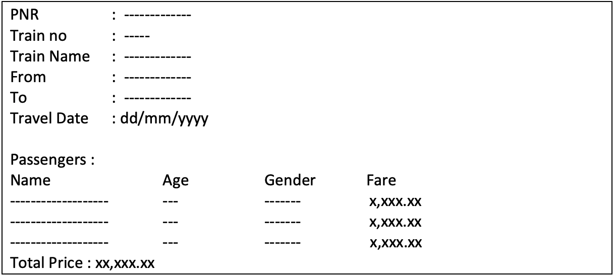
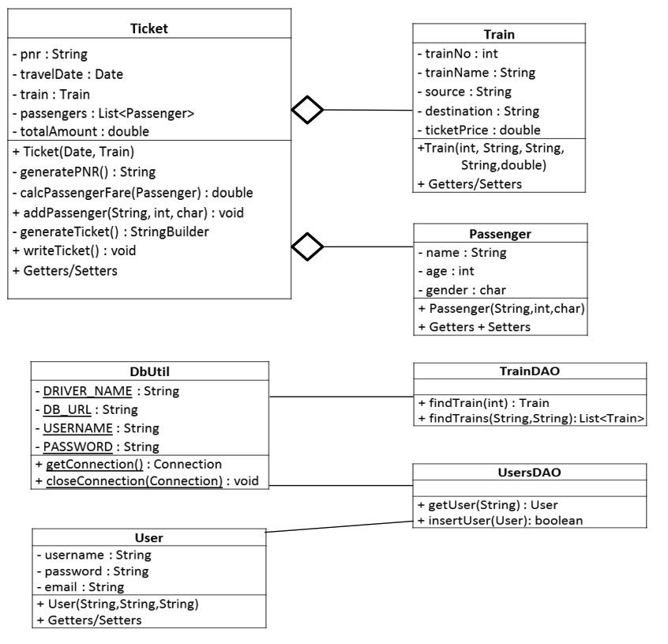
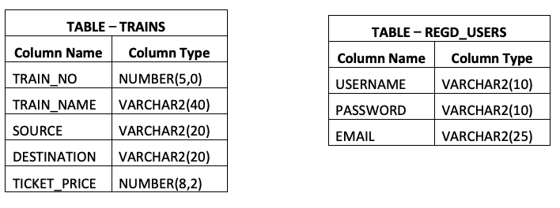

</img> 

 

    

<h1>Servlet JSP – Train Ticket Reservation</h1>

<h3>Case study Overview</h3>

This Case Study involves reserving a train ticket and downloading the ticket using a web application. The train details are stored in a database. Train details include Train number, Train Name, Source Station, Destination Station and Ticket Price.

Only registered users should be allowed to book trains. The user should be able to register on the website. Registered users should login before booking the train ticket.

The application should have the capability to search trains. User should be able to add passengers to the reservation. Passenger details include passenger name, age and gender.

The application should generate a train ticket using the train details and passenger details.
The generated ticket should contain the following details:
<ul>
  <li>PNR Number, Travel date, Train Number, Train Name, Source Station, Destination Station</li>
  <li>Name, age, gender and ticket fare for each passenger</li>
  <li>Total Ticket price</li>
</ul>

The generated ticket should be written to a File and user should be able to download the file.

Your client facing team has collected the requirements for you and the design team has created an initial design. You need to develop the Application based on the below requirements and design. 
 
Note:

- Classes should be encapsulated
- Java naming conventions should be followed
- Appropriate commenting should be done
- MVC architecture should be used to develop the web application
- Database access should be done using DAO classes
- All input fields should be validated for correctness

 
<h3>Business Requirements</h3>

- During Login, a captcha of 4 digit random number should be provided.
- The Trains should be fetched from database based on:
  - train number
  - source station and destination station
- Travel date should be after current Date
- The PNR number should be auto-generated by adding first character of source station, first character of destination station, travel date (yyyymmdd) and a counter starting from 100. The counter should be stored as a context attribute when application starts:
  - Example: PNR for train from Bangalore to Mumbai with travel date 21/01/2017 would be BM_20170121_100
- Maximum of six passengers can be added to the reservation
- The ticket Fare for each passenger is calculated using the following rules
  - For age < = 12, fare is 50% of ticket price regardless of gender
  - For age > = 60, fare is 60% of ticket price regardless of gender
  - For Females, 25% discount on the ticket price
- The credit card number should be of exactly 16 digits. Month and year of Expiry should be valid (If credit card validation is successful, assume successful payment)
- The file name for storing the generated ticket should be the PNR Number.
- The Ticket details should be stored in a file as per below format. The passenger’s should written in ascending order based on name.
</img>
 

<h3>User Interface Requirements</h3>

1. When a user accesses the application, a login page should be displayed. A link for new user registration should be available on login page.
2. After authentication, user should be able to find trains.
3. After finding train, user should be able to select the train and start reservation process.
4. User should be able to enter the date of journey, and add passengers to the reservation.
5. After adding passengers, the application should display the amount to be paid by the User. User should be allowed to enter a Credit card number, with expiry month and year of the card.
6. After payment, the ticket details should be displayed with a download link.
7. On clicking the link, ticket should get downloaded to the users computer

 
<h3>Class Diagram</h3>
Some of the classes which the application should consist are given below:
</img>

<b>Class Ticket</b>

- generatePNR method builds the PNR as per the business rules and returns the generated PNR
- calcPassengerFare method takes a passenger object as parameter, calculates the fare for the passenger and returns the ticket fare for that passenger
- addPassenger method takes passenger details as parameters, creates passenger object and adds the passenger to the List “passengers”. It should calculate the passenger fare based on business rules and add the fare to the totalAmount
- generateTicket method generates the ticket as per the given format and return the ticket in a StringBuilder
- writeTicket method writes the generated ticket to a File
 
<b>Class TrainDAO</b>

- findTrain method takes trainNo as input and returns a Train object, if train is not found, it returns null
- findTrains method takes source station and destination station as input and returns a List of Train Objects, if no trains are found, it returns null

 
<b>Class UsersDAO</b>

- getUser method takes username as input and returns a User object, if user is not found, it returns null
- insertUser method takes a User object and inserts the user in the Database. It returns a boolean

 
<h3>Table Design and Script</h3>
</img>

<b> * Execute the provided script “Trains_data.sql” to create tables and populate sample data </b>

</img>

