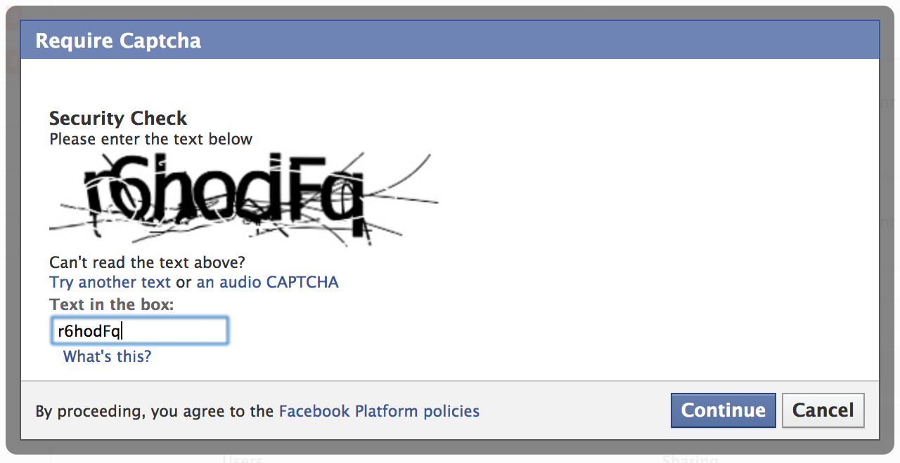
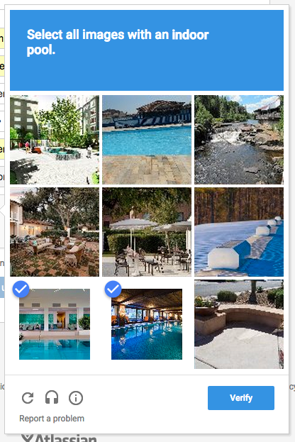
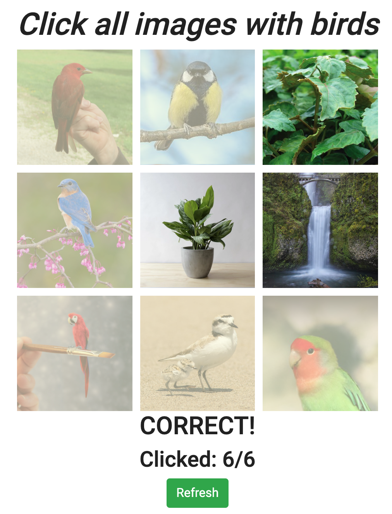

</img>
 

 

    <h1>Create your own CAPTCHA Selector</h1>
CAPTCHA stands for Completely Automated Public Turing test to tell Computers and Humans Apart. In other words, CAPTCHA determines whether the user is real or a spam robot. It is widely used on a variety of websites that want to verify that the user is not a robot. 
     Two commonly used CAPTCHAs you might have seen:
     1.Distorted text
            
</img>

     2.Mixed images</li>
            
</img>

     
    In this practice, you will create your own mixed images CAPTCHA:
    <ul>
        <li>Show a matrix of images and let users to pick out some special ones based on rule you provide</li>
        <li>Give response after users' submission</li>
        <li>Sample:</li>
        
</img>

    </ul>
    

