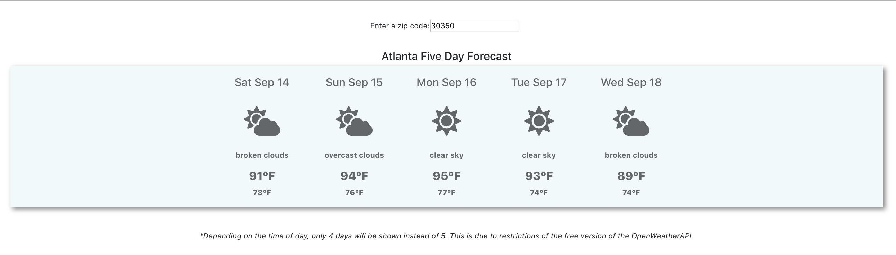
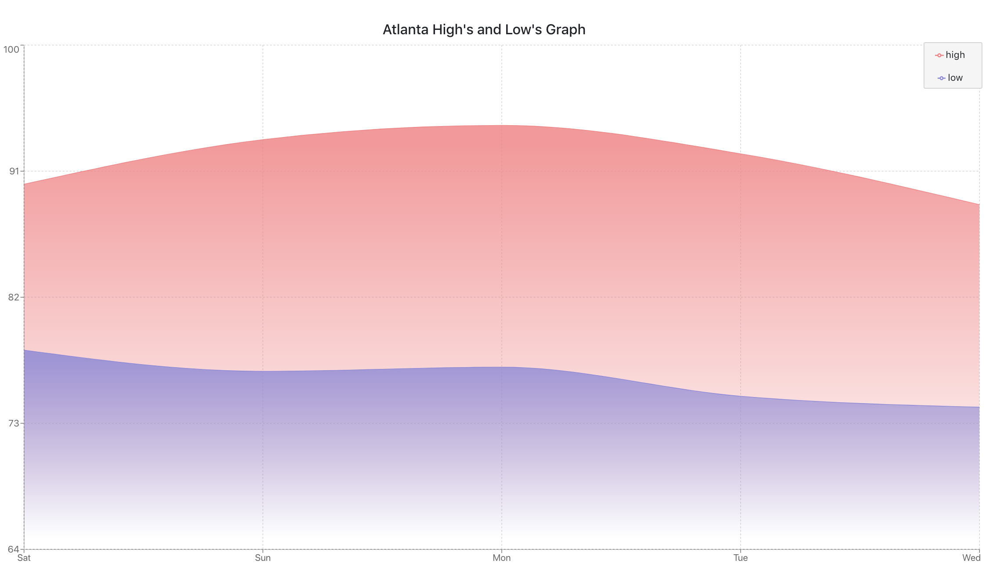

</img>
 

 

    
    <h1>Weather Forecast Application</h1>
    Your Assignment involves building a weather application which consumes open weather API. Instructions for developing your application are provided below
    <h4>GET API:</h4>
    <ol>
        <li>Go to https://home.openweathermap.org/users/sign_up and Sign up</li>
        <li>Sign in and under API tab, you will get your API KEY. Store it in your notepad</li>
        <li>Go to https://openweathermap.org/current to see the documentation of Current
Weather API’s for
            <ul>
                <li>By City name</li>
                <li>By City Id</li>
                <li>By Zip code</li>
            </ul>
        </li>
        <li>See the Json responses of those API’s</li>
    </ol>
    <h4>Front-End:</h4>
    <ol>
        <li>Create the weather components which consume the above API’s</li>
        <li>User should be able to do the following
            <ul>
                <li>By City name</li>
                <li>By City Id</li>
                <li>By Zip code</li>
            </ul>
        </li>
    </ol>
    <h4>Front-End:</h4>
    <ul>
        <li>Title</li>
        <li>Country</li>
        <li>Description</li>
        <li>Temperature</li>
        <li>Pressure</li>
        <li>Humidity</li>
        <li>Speed</li>
    </ul>
    <h4>Forecasting:</h4>
    You can explore 5 day forecast API https://openweathermap.org/forecast5 and try to perform above and this time you will be displaying a list of 5 days weather forecast
     
    <h4>Sample:</h4>
    </img>
    </img>
    

